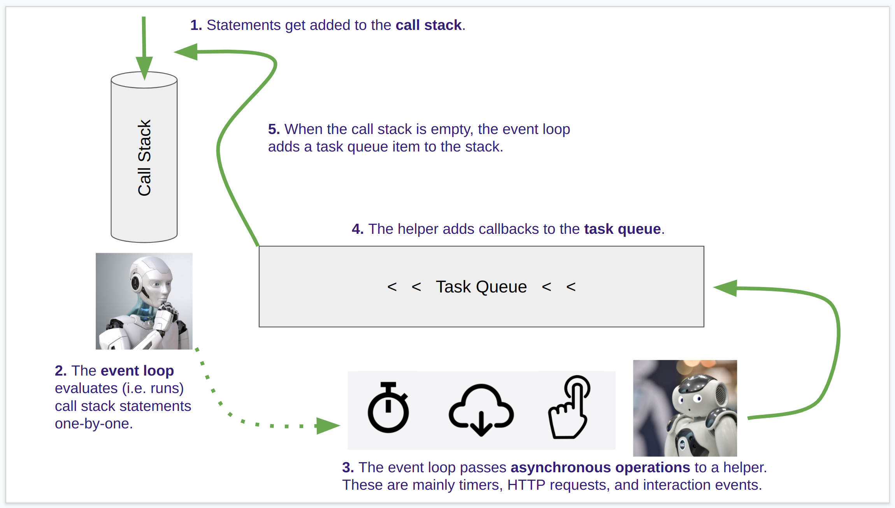

# JavaScript Execution Order
## ...or: How the browser runs your JS code

When a browser encounters a `<script>` element, it's going to:

1.  Parse the code in the script,
1.  Declare the variables that are in the global scope (which it knows about because it already parsed the whole script), and then
1.  Run the code in the global scope of the script.

## So what happens when code is run?

In a browser there are four important parts to be aware of:

1.  The call stack
1.  The event loop
1.  The task queue
1.  Asynchronous operations

The central player in running JavaScript code in a browser is the **event loop**. Imagine the event loop as a powerful robot that has been trained to do all of the hundreds of things that you can do in JavaScript.


This event loop robot can add numbers, build strings of text, find elements on a page, and so on. However, it can only do one thing at a time. Luckily it does those things really fast so it seems like it's doing a bunch of stuff at once, but really it's only doing one thing at a time.

The way that the event loop robot decides what to do is by looking at the **call stack**. Every time a JavaScript statement needs to be evaluated it gets added to the call stack. Then the event loop just takes the oldest thing from the call stack and does it until the stack is empty.

The event loop is good at knowing what it can do quickly and what it will need to wait for. In order to not slow down, the event loop delegates certain statements to a helper robot.


This helper robot is very good at doing small things and then waiting. So, the call stack will give the helper robot mainly three types of **asyncronous operations**:

* waiting for a timer,
* fetchingmaking requests for some data from a server via HTTP, and
* waiting for events from the user interface.

Along with an asynchronous statement, the event loop robot will give the helper a "callback" function so that the helper has a way of letting the event loop know when something has completed and there may be new work (i.e. statements) to put on the call stack. Whenever the helper sees something that the event loop should be aware of, the helper puts the corresponding callback function in the **task queue**. When the event loop is done with everything in the call stack, it will check the task queue to see if there's anything else to add to the call stack.



## Example 1: Simple Sequential Statements

Consider the following simple script (which exists [here](samples/01-sequential-statements/index.js) in this repository):

```js
const paragraphs = document.querySelectorAll('p');

for (let i = 0; i < paragraphs.length; i++) {
  const paragraph = paragraphs[i];
  paragraph.innerHTML = `This is paragraph ${i}.`;
}

console.log('All paragraphs are changed.');
```

After the browser parses this code, it will add statements one-by-one to the call stack. This code has no asynchronous operations, so the order of execution is fairly straightforward. If we load this code on a page that has three `<p>` elements:

1.  Get all the `<p>` elements and store them in a variable names `paragraphs`
1.  Create a variable named `i` and initialize it to `0`
1.  Check that `i` is less than the length of `paragraphs` (it is)
1.  In a new scope, create a variable named `paragraph` and initialize it to the `i`-th paragraph.
1.  Set the `innerHTML` on `paragraph`
1.  Increment the value of `i`
1.  Check that `i` is less than the length of `paragraphs` (it is)
1.  In a new scope, create a variable named `paragraph` and initialize it to the `i`-th paragraph.
1.  Set the `innerHTML` on `paragraph`
1.  Increment the value of `i`
1.  Check that `i` is less than the length of `paragraphs` (it is)
1.  In a new scope, create a variable named `paragraph` and initialize it to the `i`-th paragraph.
1.  Set the `innerHTML` on `paragraph`
1.  Increment the value of `i`
1.  Check that `i` is less than the length of `paragraphs` (it is _not_)
1.  Output a string to the console.

Example 2 in the repository is going to be similar, despite the presence of a function.

## Example 3: Loading Data

```js
const map = L.map('map').setView([39.95, -75.16], 16);
const layerGroup = L.layerGroup().addTo(map);

L.tileLayer('https://api.mapbox.com/styles/v1/mjumbe-test/cl0r2nu2q000s14q9vfkkdsfr/tiles/256/{z}/{x}/{y}@2x?access_token=pk.eyJ1IjoibWp1bWJlLXRlc3QiLCJhIjoiY2wwb3BudmZ3MWdyMjNkbzM1c2NrMGQwbSJ9.2ATDPobUwpa7Ou5jsJOGYA', {
    attribution: '&copy; <a href="https://www.openstreetmap.org/copyright">OpenStreetMap</a> contributors'
}).addTo(map);

const showMapData = (features) => {
  const layer = L.geoJSON(features);
  layerGroup.clearLayers();
  layerGroup.addLayer(layer);
};

const fetchMapData = () => {
  fetch('https://...')
    .then(resp => resp.json())
    .then(data => {
      showMapData(data);
    });
};

fetchMapData();
```

In the line that reads `.then(resp => resp.json())` above, this bit of code:

```js
resp => resp.json()
```

is short-hand for:

```js
function (resp) {
  return resp.json();
}
```

In other words, it is a function without a name that takes a single argument and returns the result of calling the `json()` function on that argument's value. Likewise, starting on the next line, the following:

```js
data => {
  showMapData(data);
}
```

is short-hand for:

```js
function (data) {
  showMapData(data);
}
```

It too is a function without a name that takes a single argument and calls the `showMapData` function on that argument's value.

Knowing this, we can give these two functions names (the specific names are arbitrary and I will choose names that make sense to me) and rewrite the script as follows:

```js
const map = L.map('map').setView([39.95, -75.16], 16);
const layerGroup = L.layerGroup().addTo(map);

L.tileLayer('https://api.mapbox.com/styles/v1/mjumbe-test/cl0r2nu2q000s14q9vfkkdsfr/tiles/256/{z}/{x}/{y}@2x?access_token=pk.eyJ1IjoibWp1bWJlLXRlc3QiLCJhIjoiY2wwb3BudmZ3MWdyMjNkbzM1c2NrMGQwbSJ9.2ATDPobUwpa7Ou5jsJOGYA', {
    attribution: '&copy; <a href="https://www.openstreetmap.org/copyright">OpenStreetMap</a> contributors'
}).addTo(map);

const showMapData = (features) => {
  const layer = L.geoJSON(features);
  layerGroup.clearLayers();
  layerGroup.addLayer(layer);
};

const handleMapDataFetchResponse = (resp) => {
  return resp.json()
};

const handleMapDataJSONParse = (data) => {
  showMapData(data);
};

const fetchMapData = () => {
  fetch('https://...')
    .then(handleMapDataFetchResponse)
    .then(handleMapDataJSONParse);
};

fetchMapData();
```

## Classes of execution

What gets executed immediately when you load a script?
* Any statements not inside of a function.
* Anything that's not a callback.

What causes a deferred action?
* **Timer events** (e.g. `setTimeout`)
* **Interaction events** (e.g. `addEventListener`)
* **Web requests** (e.g. `fetch`)

## References

* [A Brief Overview of Order of Execution in JavaScript](https://medium.com/@marcellamaki/a-brief-overview-of-order-of-execution-in-javascript-e28744aa9479)
